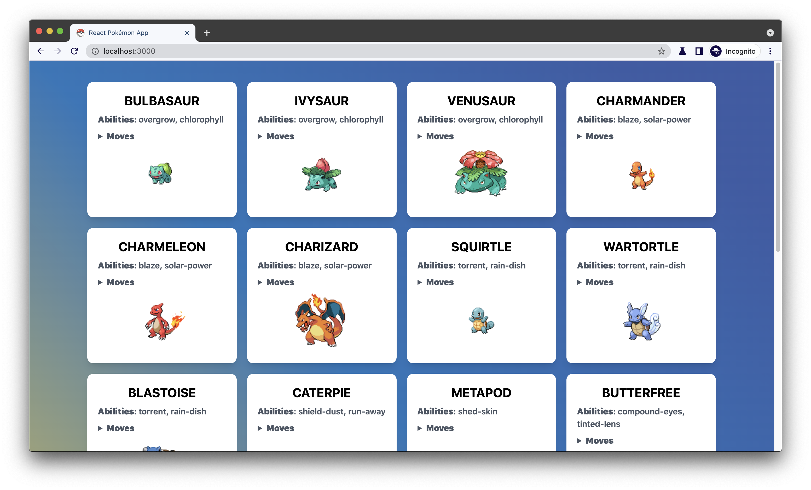

# React pokémon app

Basic Pokémon app list.

| \                                                                          | \                                                                              |
|----------------------------------------------------------------------------|--------------------------------------------------------------------------------|
| Deploy status                                                              | [](https://app.netlify.com/sites/react-pokemon-app-giulia/deploys)                                                                              |
| Deploy preview                                                             | https://react-pokemon-app-giulia.netlify.app/                                                                              |
| Project typology                                                           | 📒  Step by step from tutorial [Build A Pokémon Application With React - Web Dev Simplified](https://www.youtube.com/watch?v=o3ZUc7zH8BE&ab_channel=WebDevSimplified) |




## 🔥 Tech stack

| Purpose       | Technology   |
|:--------------|:-------------|
| Framework     | React        |
| Templating    | JSX          |
| Styling       | CSS.         |
| Documentation | Markdown     |

## 🌊 Run development mode

```shell
# install dependencies
npm i

# serve with hot reload at localhost:3000
npm run start
```

## 🧳 Build setup

```shell
# build for production
npm run build
```

## 📚 Project documentation

(check `docs/` folder for more details)

### 🌿 Branches

| Branch name | Use        |
|:------------|:-----------|
| `main`      | production |
